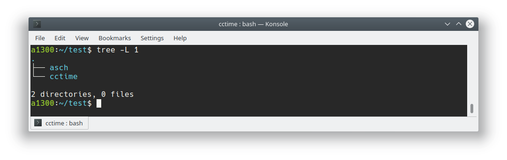
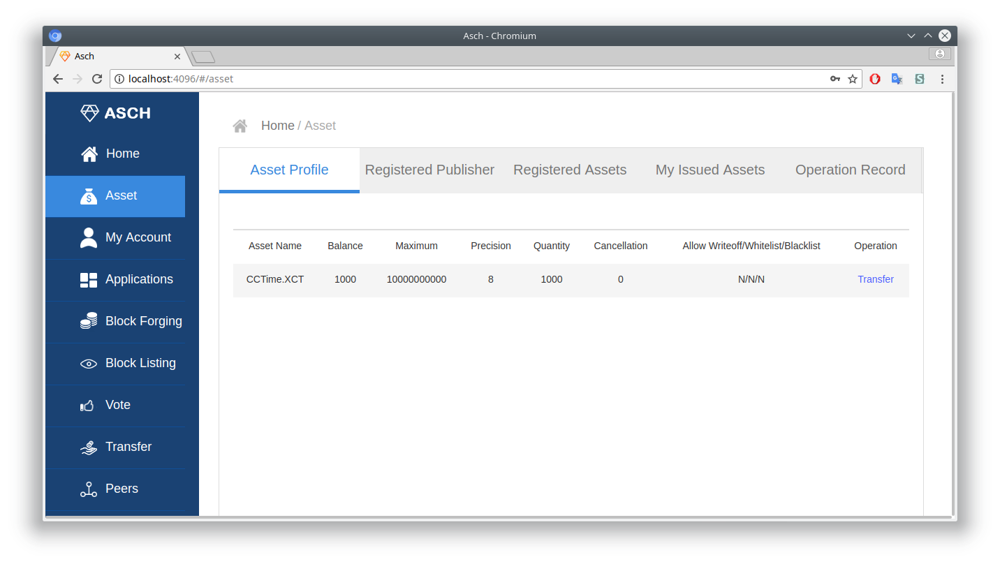
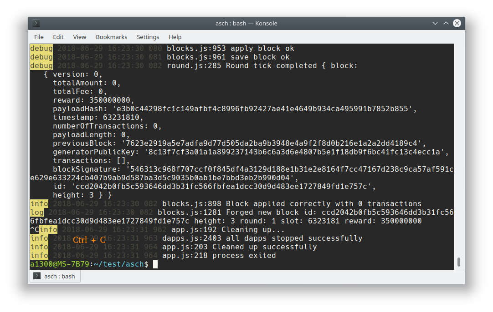
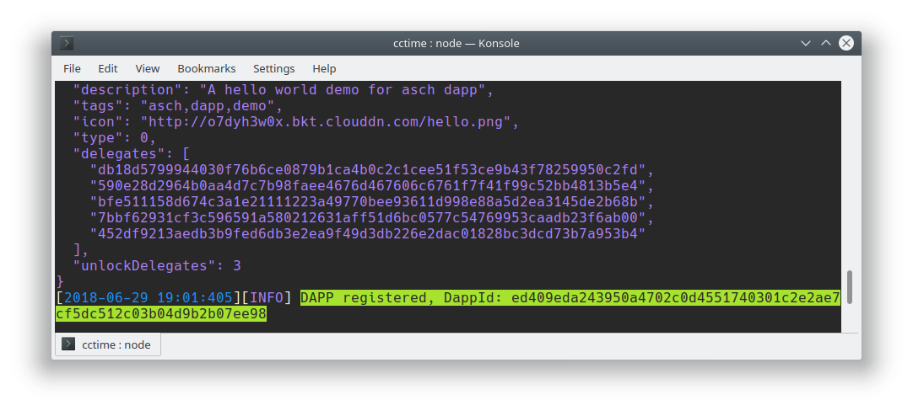
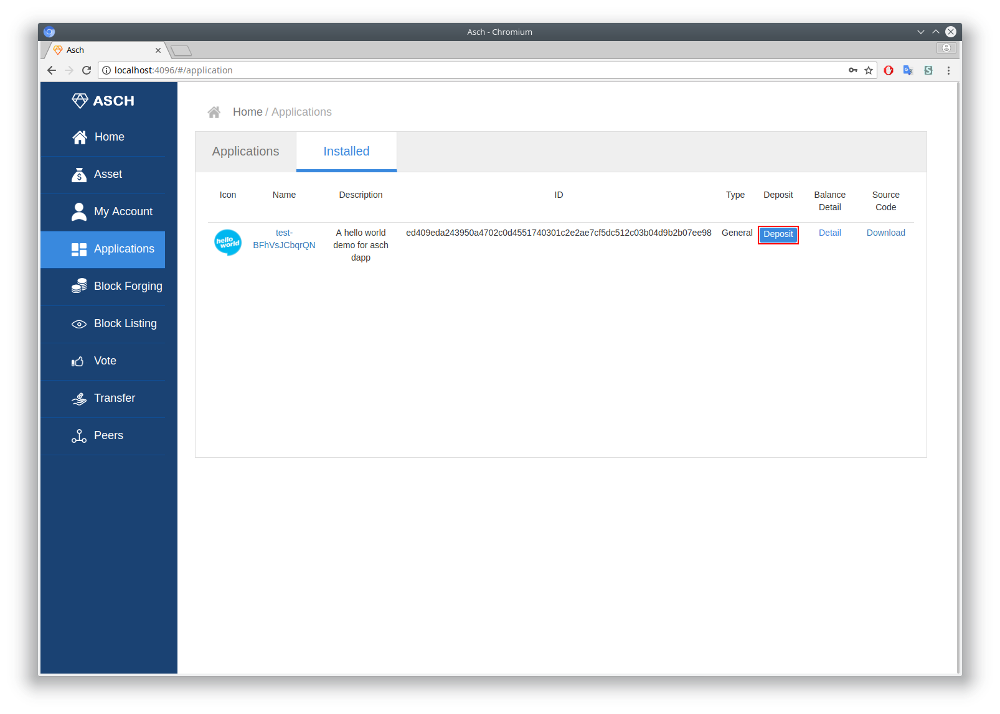
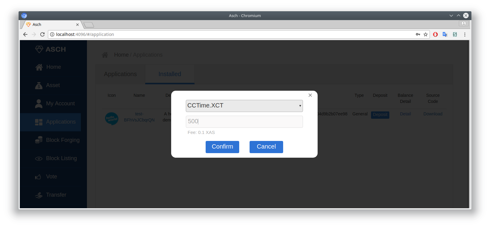

# CCTime

CCTime is a decentralized application (Dapp) based on the Asch sidechain Dapp SDK. A Dapp that communicate with the Asch main chain. The CCTime application will not issue tokens internally. The tokens will be created on the main chain. We will register a publisher called CCTime on the Asch main chain, and then use this publisher to register an asset named XCT. The full name of this asset is `CCTime.XCT` currency.  

XCT (time coin) issues a limit of 10 billion tokens. The team has set aside 5% tokens, 10% to partners, and the remaining 85% will all be airdropped to restore the nature of ICO (Initial Crypto-Token Offering).  

<!-- TOC -->

- [CCTime](#cctime)
  - [1 Installation](#1-installation)
    - [1.1 Overview](#11-overview)
    - [1.2 Preparation](#12-preparation)
      - [1.2.1 Clone cctime](#121-clone-cctime)
      - [1.2.2 Start localnet](#122-start-localnet)
      - [1.2.3 Send money to your account](#123-send-money-to-your-account)
    - [1.3 Create `CCTime.XCT` Asset](#13-create-cctimexct-asset)
      - [1.3.1 Create Publisher](#131-create-publisher)
      - [1.3.2 Register Asset](#132-register-asset)
      - [1.3.3 Create Tokens](#133-create-tokens)
    - [1.4 Register Dapp](#14-register-dapp)
      - [1.4.1 Stop the asch node](#141-stop-the-asch-node)
      - [1.4.2 Register with asch-redeploy](#142-register-with-asch-redeploy)
    - [1.5 After Dapp Registration (optional)](#15-after-dapp-registration-optional)
      - [1.5.1 Send `CCTime.XCT` tokens to Dapp](#151-send-cctimexct-tokens-to-dapp)

<!-- /TOC -->


## 1 Installation

### 1.1 Overview

This Dapp uses the `CCTime.XCT` asset in its smart contract. We need to first issue this `CCTime.XCT` asset on the mainchain before we can use it on our Dapp (sidechain).

Please follow the following steps carefully, to register your cctime app on your localnet.

### 1.2 Preparation

#### 1.2.1 Clone cctime

Clone the [cctime](https://github.com/AschPlatform/cctime) repository:  

```bash
git clone https://github.com/AschPlatform/cctime
```

#### 1.2.2 Start localnet

Start the local blockchain in the __asch__ folder. How to install the asch local node you can read [here](https://github.com/AschPlatform/asch#installation-for-ubuntu-1404x-or-higher)

```bash
cd asch

node app.js
```

Ideally you have now the following folder structure:


#### 1.2.3 Send money to your account

Our main account for this tutorial is `AHMCKebuL2nRYDgszf9J2KjVZzAw95WUyB`  

```json
{
  "address": "AHMCKebuL2nRYDgszf9J2KjVZzAw95WUyB",
  "secret": "sentence weasel match weather apple onion release keen lens deal fruit matrix",
  "publicKey": "a7cfd49d25ce247568d39b17fca221d9b2ff8402a9f6eb6346d2291a5c81374c"
}
```

We will send 5000 XAS from the genesis account to our account.  
Therefore we need a new terminal window, because in the old one is already running our localnet.  

Install all the dependencies:  
```js
cd cctime/setup

npm install
```


Then execute the following file [refuel_account.js](./setup/refuel_account.js)
```js
node refuel_account.js
```


### 1.3 Create `CCTime.XCT` Asset 

#### 1.3.1 Create Publisher

Our new account will be registered as the publisher `CCTime`

Execute the following file in a new console: [create_publisher.js](./setup/create_publisher.js) (the asch node in the other terminal still needs to run)

```js
node create_publisher.js
```


#### 1.3.2 Register Asset

After we registered as a publisher we can create our own Asset `CCTime.XCT`.

Execute the following file: [create_asset.js](./setup/create_asset.js)

```js
node create_asset.js
```

#### 1.3.3 Create Tokens

After we registered our first asset `CCTime.XCT` we need to create new tokens.

Execute the following file: [create_money](./setup/create_money.js)  

```js
node create_money.js
```

In the below picture we can see that we created a asset `CCTime.XCT` and created 1000 Tokens.



### 1.4 Register Dapp

#### 1.4.1 Stop the asch node

The asch-redeploy tool starts and stops the asch node automatically. Please switch to your terminal window where the asch node is running and terminate it (normally with Ctrl + C key shortcut).



#### 1.4.2 Register with asch-redeploy

In order to register your CCTime dapp, first install [asch-redeploy](https://github.com/AschPlatform/asch-redeploy)

```bash
npm install --global asch-redeploy
```

Then execute in the `cctime` folder:
```bash
cd cctime

asch-redeploy
```

Eventually you have to point the asch-redeploy package to the `asch` folder:

```bash
ASCH_NODE_DIR="/home/user/asch" asch-redeploy
```

After a few seconds the dapp should be successfully registered on the localnet:  



### 1.5 After Dapp Registration (optional)

#### 1.5.1 Send `CCTime.XCT` tokens to Dapp

Login into `localhost:4096` with the following secret (our account):  
```
sentence weasel match weather apple onion release keen lens deal fruit matrix
```


Under Applications / Installed we can see our new registered Dapp. We have now 1000 `CCTime.XCT` tokens on our __mainchain__ account. We could send some to our Dapp. 

__INFO:__  
> Tokens must be explicitly send to the Dapp in order for the Dapp to use it. Currently there are just 1000 `CCTime.XCT` tokens on our __mainchain__ account and not on the sidechain (Dapp).  
> Even if the __mainchain__ and the __sidechain__ account use the same secret. Assets like `CCTime.XCT` are either located on the __mainchain__ account or on the __sidechain__ (Dapp) account.





</br>
</br>
</br>  

__License__

The GPLv3 License.

Copyright (c) 2017-2018 Asch</br>
