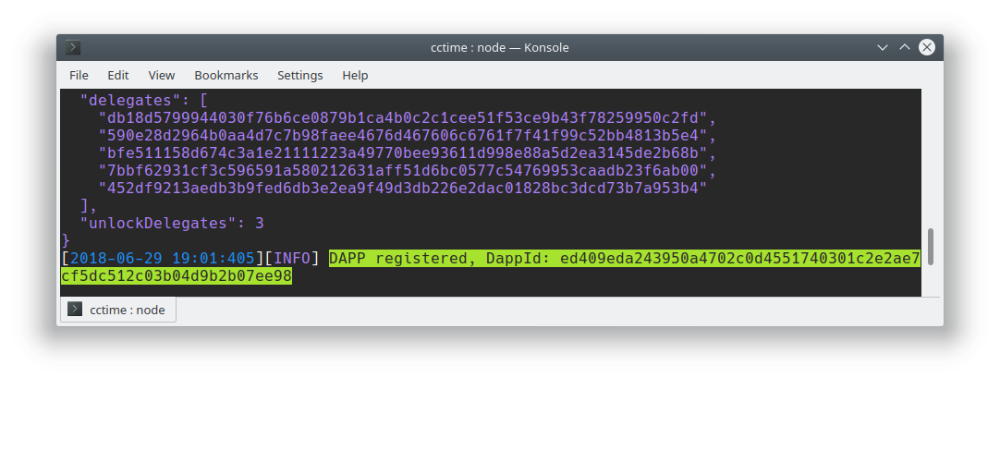

# CCTime (Backend)

CCTime is a decentralized application (Dapp) based on the Asch sidechain Dapp SDK. A Dapp that communicate with the Asch mainchain. The CCTime application will not issue tokens internally. The tokens will be created on the main chain. We will register a publisher called CCTime on the Asch main chain, and then use this publisher to register an asset named XCT. The full name of this asset is `CCTime.XCT` currency.  

XCT (time coin) issues a limit of 10 billion tokens. The team has set aside 5% tokens, 10% to partners, and the remaining 85% will all be airdropped to restore the nature of ICO (Initial Crypto-Token Offering).  

# Important  

__This repository__ is the backend part of the CCTime Dapp. Please follow __this__ installation tutorial first and then start the [cctime-frontend](https://github.com/aschplatform/cctime-frontend/) part.

__CCTIME__
- Dapp Backend: __this repository__
- Dapp Frontend: [cctime-frontend](https://github.com/aschplatform/cctime-frontend/)


<br/>

## 1 Installation

### 1.1 Preparation

Please follow the following steps carefully, to register your cctime Dapp on your localnet.


#### 1.1.1 Clone cctime

Clone __this__ repository:  

```bash
git clone https://github.com/AschPlatform/cctime
```

#### 1.1.2 Install Asch Blockchain

If you haven't installed the Asch Blockchain, the installation instructions are located [here](https://github.com/AschPlatform/asch#installation-for-ubuntu-1404x-or-higher) or [here](https://medium.com/aschplatform/develop-blockchain-apps-with-sidechain-technology-part-1-c5aa91c4602f).  

After the installation of the Asch Blockchain you should have the following file structure:


### 1.2 Register cctime

In order to register your CCTime dapp, first install [asch-redeploy](https://github.com/AschPlatform/asch-redeploy)

```bash
npm install --global asch-redeploy
```

Change directory:  
```bash
cd cctime
```
Then execute asch-redeploy in the `cctime` folder:  
```bash
asch-redeploy --publisher CCTime --asset XCT
```

After a few seconds the dapp should be successfully registered on the local Asch Blockchain:  

__DappId__  
> The new `<dapp Id>` for our Dapp is __ed409eda243950a4702c0d4551740301c2e2ae7cf5dc512c03b04d9b2b07ee98__  
> (yours will be different)




### 1.2.1 Dapp Registration behind the scenes

__Registration Account__  
The following account was used for the registration of the CCTime Dapp. This account is also the default account asch-redeploy is using for the Dapp registration. 

```json
{
  "address": "AHMCKebuL2nRYDgszf9J2KjVZzAw95WUyB",
  "secret": "sentence weasel match weather apple onion release keen lens deal fruit matrix",
  "publicKey": "a7cfd49d25ce247568d39b17fca221d9b2ff8402a9f6eb6346d2291a5c81374c"
}
```

You can use your own account with the following option: `asch-redeploy --master <secret>`

<br/>
<br/>

__Publisher and Asset__

Many steps are executed during the automatic CCTime Dapp registration. Let's have a look:  

The publisher `CCTime` was registered:  


The asset `CCTime.XCT` was registered and after that 20000 `CCTime.XCT` tokens were minted:  


And 500 `CCTime.XCT` tokens were credited to your Dapp. This operation is called Dapp Refuel.  


<br/>

__Dapp Refuel__

A Dapp Refuel is necessary because every Dapp has its account balance. In order to spend `CCTime.XCT` tokens on the CCTime Dapp you need to transfer tokens to your Dapp. You are using the __same account__ with the same secret, wheter your are on the Asch mainchain or on the CCTime Dapp. Every account has its own account balance, on the Asch Mainchain and on the CCTime Dapp. This concept is visualized below:  

Your Asch Mainchain account has a balance of 20000 `CCTime.XCT` tokens. We are going to refuel our CCTime Dapp with 500 `CCTime.XCT`.  


<br/>

After we refueled our Dapp with 500 `CCTime.XCT` tokens we can spend them for Dapp services. That wasn't possible before.  


<br/>  

Check token balance on Mainchain account:  
```bash
curl http://localhost:4096/api/uia/balances/AHMCKebuL2nRYDgszf9J2KjVZzAw95WUyB

# returns
{
  "success": true,
  "balances": [
    {
      "currency": "CCTime.XCT",
      "balance":"1950000000000",
      "maximum":"1000000000000000000",
      "precision":8,
      "quantity":"2000000000000",
      "writeoff":0,
      "allowWriteoff":0,
      "allowWhitelist":0,
      "allowBlacklist":0,
      "maximumShow":"10000000000",
      "quantityShow":"20000",
      "balanceShow":"19500" // 19500 CCTime.XCT
    }
  ],
  "count":1
}
```

Check token balance on Sidechain account:  
```bash
curl http://localhost:4096/api/dapps/<your Dapp Id>/balances/AHMCKebuL2nRYDgszf9J2KjVZzAw95WUyB

# returns
{
  "balances": [
    {
      "currency": "CCTime.XCT",
      "balance":"50000000000" // 500 CCTime.XCT
    }
  ],
  "success":true
}
```

</br>  
</br>  

__License__

The GPLv3 License.

Copyright (c) 2017-2018 Asch</br>
